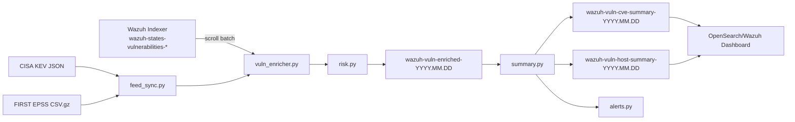

# Wazuh Vulnerability Enrichment

Production-oriented vulnerability enrichment for Wazuh 4.14.x. This project reads existing Wazuh Vulnerability Detection findings from Wazuh Indexer, enriches them with local CISA KEV and FIRST EPSS feeds, writes new enriched indices, builds summary indices for dashboards, and sends aggregate alerts instead of one alert per finding.

Vietnamese version: [README.vi.md](README.vi.md)

This phase does not use NVD, does not call the EPSS API per CVE, and does not continuously query each agent one by one.

## What This Project Does

Main flow:

1. Download CISA KEV JSON into local cache every 1 hour.
2. Download FIRST EPSS CSV.gz into local cache every 24 hours.
3. Query Wazuh vulnerability findings in batches from `wazuh-states-vulnerabilities-*`.
4. Deduplicate and enrich CVEs:
   - Whether the CVE is in KEV.
   - EPSS score.
   - EPSS percentile.
   - CVSS score from Wazuh finding.
   - Priority `P0/P1/P2/P3`.
   - Risk score.
   - Reason.
5. Bulk write into enriched index:
   - `wazuh-vuln-enriched-YYYY.MM.DD`
6. Build summary indices:
   - `wazuh-vuln-cve-summary-YYYY.MM.DD`
   - `wazuh-vuln-host-summary-YYYY.MM.DD`
7. Dashboards read only enriched/summary indices, not raw Wazuh indices continuously.
8. Send Telegram aggregate alerts when a CVE is truly worth attention.

## Architecture



## File Structure

- `config.yaml`: service configuration.
- `vuln_enricher.py`: main CLI and daemon mode.
- `feed_sync.py`: download and parse CISA KEV and EPSS.
- `wazuh_client.py`: connect to Wazuh Indexer/OpenSearch, scroll query, bulk index.
- `risk.py`: priority logic, risk score, finding normalization.
- `alerts.py`: aggregate alerts and deduplication.
- `state.py`: local state storage.
- `summary.py`: CVE summary and host summary builders.
- `dashboard/`: dashboard setup guide.
- `tests/`: unit tests.

## Requirements

- Python 3.10 or newer.
- Wazuh 4.14.x with Vulnerability Detection enabled.
- Wazuh Indexer has `wazuh-states-vulnerabilities-*`.
- The service host can reach the internet to download:
  - CISA KEV JSON.
  - FIRST EPSS CSV.gz.
- Indexer user/password with permission to read Wazuh vulnerability indices and write new enriched/summary indices.

## Install

Linux:

```bash
cd /opt/wazuh-enrich
python3.10 -m venv .venv
. .venv/bin/activate
pip install -r requirements.txt
```

Windows PowerShell:

```powershell
cd C:\Users\HuuKhoi\Desktop\MyProjects\monitor\wazuh-enrich
python -m venv .venv
.\.venv\Scripts\Activate.ps1
pip install -r requirements.txt
```

## Configuration

Do not hardcode credentials in code. Use environment variables.

Linux:

```bash
export WAZUH_INDEXER_URL="https://wazuh-indexer.example.com:9200"
export WAZUH_INDEXER_USERNAME="admin"
export WAZUH_INDEXER_PASSWORD="your-password"
export WAZUH_CA_CERT="/etc/filebeat/certs/root-ca.pem"
export TELEGRAM_BOT_TOKEN="123456:telegram-token"
export TELEGRAM_CHAT_ID="-1001234567890"
```

Windows PowerShell:

```powershell
$env:WAZUH_INDEXER_URL="https://wazuh-indexer.example.com:9200"
$env:WAZUH_INDEXER_USERNAME="admin"
$env:WAZUH_INDEXER_PASSWORD="your-password"
$env:WAZUH_CA_CERT="C:\certs\root-ca.pem"
$env:TELEGRAM_BOT_TOKEN="123456:telegram-token"
$env:TELEGRAM_CHAT_ID="-1001234567890"
```

The default [config.yaml](config.yaml) includes:

```yaml
WAZUH_VULN_INDEX_PATTERN: wazuh-states-vulnerabilities-*
ENRICHED_INDEX_PREFIX: wazuh-vuln-enriched
CVE_SUMMARY_INDEX_PREFIX: wazuh-vuln-cve-summary
HOST_SUMMARY_INDEX_PREFIX: wazuh-vuln-host-summary
PAGE_SIZE: 2000
BULK_SIZE: 1000
```

For a lab without a proper CA certificate, you can temporarily use:

```yaml
VERIFY_SSL: false
```

Production should use `VERIFY_SSL: true` and configure `WAZUH_CA_CERT`.

## First Run

1. Test feed download:

```bash
python3 vuln_enricher.py sync-feeds
```

2. Run dry-run first to validate logic without writing indices or sending Telegram alerts:

```bash
python3 vuln_enricher.py --dry-run enrich-all
```

3. If the logs look good, run full enrichment:

```bash
python3 vuln_enricher.py enrich-all
```

After the run, check for the new indices:

```text
wazuh-vuln-enriched-YYYY.MM.DD
wazuh-vuln-cve-summary-YYYY.MM.DD
wazuh-vuln-host-summary-YYYY.MM.DD
```

## CLI Commands

Download KEV and EPSS feeds:

```bash
python3 vuln_enricher.py sync-feeds
```

Enrich all findings:

```bash
python3 vuln_enricher.py enrich-all
```

Enrich one agent:

```bash
python3 vuln_enricher.py enrich-agent --agent-id 001
```

Detect new agents, create baseline reports, and alert if P0/P1 exists:

```bash
python3 vuln_enricher.py detect-new-agents
```

Run one complete cycle:

```bash
python3 vuln_enricher.py run-once
```

Run daemon mode:

```bash
python3 vuln_enricher.py daemon
```

## Daemon Mode

The daemon runs on this schedule:

- CISA KEV: every 1 hour.
- EPSS: every 24 hours.
- Enrichment: every 15 minutes.
- New agent detection: every 5 minutes.

The schedule is configurable in `SCHEDULE` inside `config.yaml`.

## Cron

Example, run every 15 minutes:

```cron
*/15 * * * * cd /opt/wazuh-enrich && . .venv/bin/activate && python3 vuln_enricher.py run-once >> /var/log/wazuh-enrich.log 2>&1
```

If you use cron, you do not need `daemon`.

## systemd

Create `/etc/wazuh-enrich.env`:

```bash
WAZUH_INDEXER_URL=https://wazuh-indexer.example.com:9200
WAZUH_INDEXER_USERNAME=admin
WAZUH_INDEXER_PASSWORD=your-password
WAZUH_CA_CERT=/etc/filebeat/certs/root-ca.pem
TELEGRAM_BOT_TOKEN=123456:telegram-token
TELEGRAM_CHAT_ID=-1001234567890
```

Create `/etc/systemd/system/wazuh-enrich.service`:

```ini
[Unit]
Description=Wazuh vulnerability enrichment service
After=network-online.target
Wants=network-online.target

[Service]
Type=simple
WorkingDirectory=/opt/wazuh-enrich
EnvironmentFile=/etc/wazuh-enrich.env
ExecStart=/opt/wazuh-enrich/.venv/bin/python3 /opt/wazuh-enrich/vuln_enricher.py daemon
Restart=always
RestartSec=10
User=wazuh-enrich
Group=wazuh-enrich

[Install]
WantedBy=multi-user.target
```

Enable the service:

```bash
sudo systemctl daemon-reload
sudo systemctl enable --now wazuh-enrich
sudo journalctl -u wazuh-enrich -f
```

## Priority Logic

P0:

- CVE is in CISA KEV.
- Or EPSS >= 0.7 and CVSS >= 8.

P1:

- EPSS >= 0.3.
- Or CVSS >= 8.

P2:

- CVSS >= 6.

P3:

- Everything else.

Risk score:

```text
(epss_score * 50) + (cvss_score * 3) + (30 if kev=true)
```

## Alerts

The service alerts only for meaningful signals:

- CVE is in KEV.
- Priority is P0.
- EPSS crosses a threshold.
- New agent has P0/P1.
- CVE transitions from non-KEV to KEV.
- CVE affects many agents.

Dedup keys are stored in the state file to avoid repeatedly sending the same alert.

Default state file:

```text
.cache/state.json
```

The state stores:

- `seen_agents`
- `last_processed_timestamp`
- `last_kev_status_by_cve`
- `last_epss_threshold_by_cve`
- `alert_dedup_keys`

Sample alert:

```text
CRITICAL - Exploited CVEs detected

Summary:
- Affected agents: 113
- P0 CVEs: 4
- KEV CVEs: 2
- EPSS >= 0.7: 3

Top CVEs:
1. CVE-2025-0001 | KEV=yes | EPSS=0.94 | CVSS=9.8 | hosts=72 | package=openssl
2. CVE-2025-0002 | KEV=no | EPSS=0.88 | CVSS=8.8 | hosts=41 | package=nginx
```

## Dashboard

See [dashboard/README.md](dashboard/README.md).

Create 3 data views/index patterns:

| Data view | Time field |
| --- | --- |
| `wazuh-vuln-enriched-*` | `detected_at` |
| `wazuh-vuln-cve-summary-*` | `updated_at` |
| `wazuh-vuln-host-summary-*` | `updated_at` |

The dashboard should include:

- Total agents.
- Vulnerable agents.
- Total active CVE findings.
- Unique CVEs.
- P0 CVEs.
- P1 CVEs.
- KEV CVEs.
- EPSS >= 0.7 CVEs.
- New CVEs in last 24h.
- New CVEs in last 7d.
- CVE impact overview table.
- Host impact overview table.
- CVE count by year.
- CVE count by priority.
- KEV trend.
- Top affected hosts.
- Top affected packages.
- New findings over time.

Important: the production dashboard should read summary indices, not `wazuh-states-vulnerabilities-*` directly.

## Quick Query Checks

Top risky CVEs:

```bash
curl -sk -u "$WAZUH_INDEXER_USERNAME:$WAZUH_INDEXER_PASSWORD" \
  "$WAZUH_INDEXER_URL/wazuh-vuln-cve-summary-*/_search" \
  -H 'Content-Type: application/json' \
  -d '{"size":10,"sort":[{"risk_score":"desc"},{"affected_hosts_count":"desc"}]}'
```

Top risky hosts:

```bash
curl -sk -u "$WAZUH_INDEXER_USERNAME:$WAZUH_INDEXER_PASSWORD" \
  "$WAZUH_INDEXER_URL/wazuh-vuln-host-summary-*/_search" \
  -H 'Content-Type: application/json' \
  -d '{"size":10,"sort":[{"p0_count":"desc"},{"kev_count":"desc"},{"highest_epss":"desc"}]}'
```

Drill down one CVE:

```bash
curl -sk -u "$WAZUH_INDEXER_USERNAME:$WAZUH_INDEXER_PASSWORD" \
  "$WAZUH_INDEXER_URL/wazuh-vuln-enriched-*/_search" \
  -H 'Content-Type: application/json' \
  -d '{"size":1000,"query":{"term":{"cve_id":"CVE-2025-0001"}},"sort":[{"risk_score":"desc"}]}'
```

Drill down one host:

```bash
curl -sk -u "$WAZUH_INDEXER_USERNAME:$WAZUH_INDEXER_PASSWORD" \
  "$WAZUH_INDEXER_URL/wazuh-vuln-enriched-*/_search" \
  -H 'Content-Type: application/json' \
  -d '{"size":1000,"query":{"term":{"agent_id":"001"}},"sort":[{"risk_score":"desc"}]}'
```

## Tests

Run unit tests:

```bash
python3 -m pytest -q
```

Check syntax:

```bash
python3 -m py_compile config.py feed_sync.py risk.py alerts.py state.py summary.py wazuh_client.py vuln_enricher.py
```

## Performance Notes

- Raw Wazuh vulnerability findings are read with scroll and `_source` filtering.
- Default `PAGE_SIZE` is 2000 and `BULK_SIZE` is 1000.
- Dashboards should read enriched and summary indices, not raw Wazuh vulnerability state indices.
- `run-once` uses `last_processed_timestamp` after the initial run to reduce repeated raw reads.
- Summary rebuilds read the daily enriched index, which is intentionally compact and dashboard-oriented.

This is sized for at least 1000 Wazuh agents and 100k+ findings, assuming the Wazuh Indexer cluster has normal production resources and dashboards use the summary indices.

## Troubleshooting

Error `Missing required config values`:

- Check env vars `WAZUH_INDEXER_URL`, `WAZUH_INDEXER_USERNAME`, `WAZUH_INDEXER_PASSWORD`.
- Check `config.yaml`.

No findings:

- Check that Wazuh has `wazuh-states-vulnerabilities-*`.
- Check that Vulnerability Detection has `index-status` enabled.

SSL error:

- Check `WAZUH_CA_CERT`.
- Labs can use `VERIFY_SSL: false`; production should not.

Telegram is not sending:

- Check `TELEGRAM_BOT_TOKEN`.
- Check `TELEGRAM_CHAT_ID`.
- If both are empty, the service logs `telegram_not_configured` and skips alert delivery.

First run is slow:

- This is normal with 100k+ findings.
- After the first run, `run-once` uses `last_processed_timestamp` for incremental processing.

Dashboard is slow:

- Make sure the dashboard reads `wazuh-vuln-cve-summary-*` and `wazuh-vuln-host-summary-*`.
- Avoid building visualizations directly on raw `wazuh-states-vulnerabilities-*`.

## Recommended Start Workflow

1. Install dependencies.
2. Export env vars.
3. Run `python3 vuln_enricher.py sync-feeds`.
4. Run `python3 vuln_enricher.py --dry-run enrich-all`.
5. If logs look good, run `python3 vuln_enricher.py enrich-all`.
6. Create data views in Wazuh/OpenSearch Dashboard.
7. Set up the dashboard using `dashboard/README.md`.
8. Enable cron or systemd daemon.
