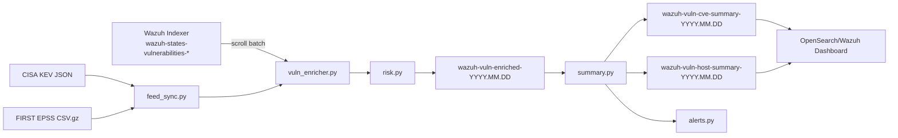

# Wazuh Vulnerability Enrichment

Hệ thống enrichment CVE cho Wazuh 4.14.x. Project này đọc vulnerability findings có sẵn trong Wazuh Indexer, enrich bằng CISA KEV và FIRST EPSS local cache, ghi ra index mới, build summary cho dashboard, và gửi alert dạng tổng hợp thay vì spam từng finding.

English version: [README.md](README.md)

Phase này không dùng NVD, không gọi EPSS API theo từng CVE, không query từng agent liên tục.

## Project Này Làm Gì?

Flow chính:

1. Tải CISA KEV JSON về local cache mỗi 1 giờ.
2. Tải FIRST EPSS CSV.gz về local cache mỗi 24 giờ.
3. Query Wazuh vulnerability findings theo batch từ `wazuh-states-vulnerabilities-*`.
4. Deduplicate và enrich CVE:
   - CVE có nằm trong KEV không.
   - EPSS score.
   - EPSS percentile.
   - CVE đã có public PoC chưa, nếu cấu hình `POC_FEED_FILE`.
   - CVSS score từ Wazuh finding.
   - Priority `P0/P1/P2/P3`.
   - Risk score.
   - Reason.
5. Bulk write vào index enriched:
   - `wazuh-vuln-enriched-YYYY.MM.DD`
6. Build summary index:
   - `wazuh-vuln-cve-summary-YYYY.MM.DD`
   - `wazuh-vuln-host-summary-YYYY.MM.DD`
7. Dashboard chỉ đọc enriched/summary index, không đọc raw index liên tục.
8. Gửi Telegram alert dạng aggregate khi có CVE thật sự đáng chú ý.

## Kiến Trúc



## Cấu Trúc File

- `config.yaml`: cấu hình service.
- `vuln_enricher.py`: CLI chính và daemon mode.
- `feed_sync.py`: tải và parse CISA KEV, EPSS.
- `wazuh_client.py`: kết nối Wazuh Indexer/OpenSearch, scroll query, bulk index.
- `risk.py`: logic priority, risk score, normalize finding.
- `alerts.py`: aggregate alert và dedup.
- `state.py`: lưu state local.
- `summary.py`: build CVE summary và host summary.
- `dashboard/`: hướng dẫn setup dashboard.
- `tests/`: unit tests.

## Yêu Cầu

- Python 3.10 trở lên.
- Wazuh 4.14.x đã bật Vulnerability Detection.
- Wazuh Indexer có index `wazuh-states-vulnerabilities-*`.
- Service host có network ra ngoài để tải:
  - CISA KEV JSON.
  - FIRST EPSS CSV.gz.
- User/password đọc Wazuh Indexer và ghi index mới.

## Cài Đặt

Linux:

```bash
cd /opt/wazuh-enrich
python3.10 -m venv .venv
. .venv/bin/activate
pip install -r requirements.txt
```

Windows PowerShell:

```powershell
cd C:\Users\HuuKhoi\Desktop\MyProjects\monitor\wazuh-enrich
python -m venv .venv
.\.venv\Scripts\Activate.ps1
pip install -r requirements.txt
```

## Cấu Hình

Không hardcode credential vào code. Dùng environment variables.

Linux:

```bash
export WAZUH_INDEXER_URL="https://wazuh-indexer.example.com:9200"
export WAZUH_INDEXER_USERNAME="admin"
export WAZUH_INDEXER_PASSWORD="your-password"
export WAZUH_CA_CERT="/etc/filebeat/certs/root-ca.pem"
export TELEGRAM_BOT_TOKEN="123456:telegram-token"
export TELEGRAM_CHAT_ID="-1001234567890"
```

Windows PowerShell:

```powershell
$env:WAZUH_INDEXER_URL="https://wazuh-indexer.example.com:9200"
$env:WAZUH_INDEXER_USERNAME="admin"
$env:WAZUH_INDEXER_PASSWORD="your-password"
$env:WAZUH_CA_CERT="C:\certs\root-ca.pem"
$env:TELEGRAM_BOT_TOKEN="123456:telegram-token"
$env:TELEGRAM_CHAT_ID="-1001234567890"
```

File [config.yaml](config.yaml) đã có sẵn default:

```yaml
WAZUH_VULN_INDEX_PATTERN: wazuh-states-vulnerabilities-*
ENRICHED_INDEX_PREFIX: wazuh-vuln-enriched
CVE_SUMMARY_INDEX_PREFIX: wazuh-vuln-cve-summary
HOST_SUMMARY_INDEX_PREFIX: wazuh-vuln-host-summary
PAGE_SIZE: 2000
BULK_SIZE: 1000
```

Nếu server của bạn bị chặn khi tải CISA KEV URL, dùng file local hoặc mirror nội bộ:

```bash
export CISA_KEV_FILE="/opt/wazuh-enrich/feeds/known_exploited_vulnerabilities.json"
```

Khi `CISA_KEV_FILE` được set, service sẽ đọc KEV từ file JSON local đó và không download trực tiếp từ CISA. Bạn có thể update file này bằng browser, job mirror nội bộ, rsync/scp từ máy khác, hoặc artifact repository của công ty. Nếu có internal HTTP mirror, set `CISA_KEV_URL` sang URL mirror đó.

Nếu môi trường cần proxy, `requests` cũng đọc các biến môi trường chuẩn:

```bash
export HTTPS_PROXY="http://proxy.example.com:8080"
export HTTP_PROXY="http://proxy.example.com:8080"
```

Nếu lab không có CA certificate chuẩn, có thể tạm dùng:

```yaml
VERIFY_SSL: false
```

Production nên dùng `VERIFY_SSL: true` và cấu hình `WAZUH_CA_CERT`.

Enrich thêm public PoC, tùy chọn:

```bash
export POC_FEED_FILE="/opt/wazuh-enrich/feeds/cve_poc.csv"
```

PoC feed được thiết kế là local/offline để service không query GitHub, Exploit-DB, hoặc internet API theo từng CVE. Format CSV:

```csv
cve,url,source
CVE-2026-0001,https://example.com/research-or-repo,internal
```

JSON cũng được hỗ trợ:

```json
{
  "CVE-2026-0001": [
    {"url": "https://example.com/research-or-repo", "source": "internal"}
  ]
}
```

Khi CVE có trong feed này, enriched document sẽ có thêm `public_poc`, `poc_count`, `poc_references`, và `poc_sources`.

Để build `cve_poc.csv` từ metadata nguồn uy tín mà không tải PoC code, dùng [tools/build_poc_feed.py](tools/build_poc_feed.py).

Nguồn metadata khuyến nghị:

- Exploit-DB official metadata: https://gitlab.com/exploit-database/exploitdb
- ProjectDiscovery nuclei templates: https://github.com/projectdiscovery/nuclei-templates
- nomi-sec PoC-in-GitHub metadata: https://github.com/nomi-sec/PoC-in-GitHub
- trickest CVE PoC metadata: https://github.com/trickest/cve

Ví dụ:

```bash
# Chỉ lấy metadata CSV của Exploit-DB. Không tải exploit code.
python3 tools/build_poc_feed.py \
  --exploitdb-csv "https://gitlab.com/exploit-database/exploitdb/-/raw/main/files_exploits.csv" \
  --output feeds/cve_poc.csv

# Đọc local nuclei-templates checkout. Chỉ đọc metadata template.
python3 tools/build_poc_feed.py \
  --nuclei-templates /data/security-feeds/nuclei-templates \
  --output feeds/cve_poc.csv

# Gộp nhiều metadata repo local.
python3 tools/build_poc_feed.py \
  --nuclei-templates /data/security-feeds/nuclei-templates \
  --poc-in-github /data/security-feeds/PoC-in-GitHub \
  --trickest-cve /data/security-feeds/trickest-cve \
  --output feeds/cve_poc.csv
```

Production nên chạy feed-builder trên một feed/mirror host riêng, rồi copy duy nhất file `feeds/cve_poc.csv` sang Wazuh enrichment server.

## Chạy Lần Đầu

1. Test tải feed:

```bash
python3 vuln_enricher.py sync-feeds
```

`sync-feeds` xử lý chung KEV, EPSS, và PoC metadata. Nếu chỉ muốn refresh PoC metadata:

```bash
python3 vuln_enricher.py sync-poc
```

2. Chạy dry-run trước để kiểm tra logic mà chưa ghi index/chưa gửi Telegram:

```bash
python3 vuln_enricher.py --dry-run enrich-all
```

3. Nếu ổn, chạy enrich toàn bộ:

```bash
python3 vuln_enricher.py enrich-all
```

Sau khi chạy, kiểm tra các index mới:

```text
wazuh-vuln-enriched-YYYY.MM.DD
wazuh-vuln-cve-summary-YYYY.MM.DD
wazuh-vuln-host-summary-YYYY.MM.DD
```

## Các Lệnh CLI

Tải feed KEV, EPSS, và PoC metadata:

```bash
python3 vuln_enricher.py sync-feeds
```

Refresh riêng PoC metadata:

```bash
python3 vuln_enricher.py sync-poc
```

Enrich toàn bộ findings:

```bash
python3 vuln_enricher.py enrich-all
```

Enrich riêng một agent:

```bash
python3 vuln_enricher.py enrich-agent --agent-id 001
```

Detect agent mới, tạo baseline report, alert nếu có P0/P1:

```bash
python3 vuln_enricher.py detect-new-agents
```

Chạy một vòng đầy đủ:

```bash
python3 vuln_enricher.py run-once
```

Chạy daemon:

```bash
python3 vuln_enricher.py daemon
```

Mặc định log dạng JSON để phù hợp production collector. Khi đọc trực tiếp trên terminal, dùng text log:

```bash
python3 vuln_enricher.py --dry-run run-once
python3 vuln_enricher.py --log-format text --dry-run run-once
```

Khi chạy `--dry-run`, alert sẽ được in thành block dễ đọc và không gửi Telegram.

## Daemon Mode

Daemon sẽ chạy theo lịch:

- CISA KEV: mỗi 1 giờ.
- EPSS: mỗi 24 giờ.
- Enrichment: mỗi 15 phút.
- Detect agent mới: mỗi 5 phút.

Cấu hình nằm trong `SCHEDULE` của `config.yaml`.

## Chạy Bằng Cron

Ví dụ chạy mỗi 15 phút:

```cron
*/15 * * * * cd /opt/wazuh-enrich && . .venv/bin/activate && python3 vuln_enricher.py run-once >> /var/log/wazuh-enrich.log 2>&1
```

Nếu dùng cron thì không cần chạy `daemon`.

## Chạy Bằng systemd

Tạo file `/etc/wazuh-enrich.env`:

```bash
WAZUH_INDEXER_URL=https://wazuh-indexer.example.com:9200
WAZUH_INDEXER_USERNAME=admin
WAZUH_INDEXER_PASSWORD=your-password
WAZUH_CA_CERT=/etc/filebeat/certs/root-ca.pem
TELEGRAM_BOT_TOKEN=123456:telegram-token
TELEGRAM_CHAT_ID=-1001234567890
```

Tạo service `/etc/systemd/system/wazuh-enrich.service`:

```ini
[Unit]
Description=Wazuh vulnerability enrichment service
After=network-online.target
Wants=network-online.target

[Service]
Type=simple
WorkingDirectory=/opt/wazuh-enrich
EnvironmentFile=/etc/wazuh-enrich.env
ExecStart=/opt/wazuh-enrich/.venv/bin/python3 /opt/wazuh-enrich/vuln_enricher.py daemon
Restart=always
RestartSec=10
User=wazuh-enrich
Group=wazuh-enrich

[Install]
WantedBy=multi-user.target
```

Enable service:

```bash
sudo systemctl daemon-reload
sudo systemctl enable --now wazuh-enrich
sudo journalctl -u wazuh-enrich -f
```

## Logic Priority

P0:

- CVE nằm trong CISA KEV.
- Hoặc EPSS >= 0.7 và CVSS >= 8.

P1:

- EPSS >= 0.3.
- Hoặc CVSS >= 8.

P2:

- CVSS >= 6.

P3:

- Còn lại.

Risk score:

```text
(epss_score * 50) + (cvss_score * 3) + (30 nếu kev=true)
```

## Alert

Service chỉ alert khi có tín hiệu quan trọng:

- CVE nằm trong KEV.
- Priority là P0.
- EPSS vượt threshold.
- Agent mới có P0/P1.
- CVE chuyển từ non-KEV sang KEV.
- CVE mới ảnh hưởng nhiều agent.

Dedup key được lưu trong state file, tránh gửi lại cùng một alert nhiều lần.

State file mặc định:

```text
.cache/state.json
```

State lưu:

- `seen_agents`
- `last_processed_timestamp`
- `last_kev_status_by_cve`
- `last_epss_threshold_by_cve`
- `alert_dedup_keys`

Ví dụ alert:

```text
CRITICAL - Exploited CVEs detected

Summary:
- Affected agents: 2
- P0 CVEs: 4
- KEV CVEs: 2
- Public PoC CVEs: 1
- EPSS >= 0.7: 3

Top CVEs:
1. CVE-2025-0001 | KEV=yes | PoC=yes | EPSS=0.94 | CVSS=9.8 | hosts=72 | package=openssl
2. CVE-2025-0002 | KEV=no | PoC=no | EPSS=0.88 | CVSS=8.8 | hosts=41 | package=nginx
```

`Affected agents` là số Wazuh agent ID unique bị ảnh hưởng bởi các CVE trong alert. Nếu alert được build mà không có enriched finding context, service sẽ fallback sang `Affected host-CVE pairs`, nghĩa là tổng số affected-host count cộng theo từng CVE.

## Dashboard

Xem hướng dẫn chi tiết tại [dashboard/README.md](dashboard/README.md).

Cách nhanh: import saved objects file:

```text
dashboard/wazuh-vuln-enrichment.ndjson
```

Trong Wazuh/OpenSearch Dashboard, vào `Saved Objects` -> `Import`, chọn file này, rồi mở dashboard `Wazuh Vulnerability Enrichment Overview`.

Dashboard import sẽ đặt PoC impact ở phần trên:

- `Impact Filters`, có dropdown chọn public PoC CVE đang impact hệ thống
- `Public PoC CVEs Impacting This System`
- `Hosts Affected by Public PoC CVEs`

Hai bảng này cho biết CVE nào đã có public PoC đang ảnh hưởng môi trường của bạn và host/package nào bị ảnh hưởng.

Nếu sau này muốn xóa hoặc import lại:

```bash
python3 dashboard/manage_saved_objects.py list --no-verify-ssl
python3 dashboard/manage_saved_objects.py delete --no-verify-ssl
python3 dashboard/manage_saved_objects.py reimport --no-verify-ssl
```

Tạo 3 data views/index patterns:

| Data view | Time field |
| --- | --- |
| `wazuh-vuln-enriched-*` | `detected_at` |
| `wazuh-vuln-cve-summary-*` | `updated_at` |
| `wazuh-vuln-host-summary-*` | `updated_at` |

Dashboard nên có:

- Total agents.
- Vulnerable agents.
- Total active CVE findings.
- Unique CVEs.
- P0 CVEs.
- P1 CVEs.
- KEV CVEs.
- EPSS >= 0.7 CVEs.
- New CVEs in last 24h.
- New CVEs in last 7d.
- CVE impact overview table.
- Host impact overview table.
- CVE count by year.
- CVE count by priority.
- KEV trend.
- Top affected hosts.
- Top affected packages.
- New findings over time.
- Public PoC CVEs, dùng filter `public_poc:true`.

Quan trọng: dashboard production nên đọc summary index, không đọc trực tiếp `wazuh-states-vulnerabilities-*`.

## Query Kiểm Tra Nhanh

Top CVE nguy hiểm:

```bash
curl -sk -u "$WAZUH_INDEXER_USERNAME:$WAZUH_INDEXER_PASSWORD" \
  "$WAZUH_INDEXER_URL/wazuh-vuln-cve-summary-*/_search" \
  -H 'Content-Type: application/json' \
  -d '{"size":10,"sort":[{"risk_score":"desc"},{"affected_hosts_count":"desc"}]}'
```

Top host nguy hiểm:

```bash
curl -sk -u "$WAZUH_INDEXER_USERNAME:$WAZUH_INDEXER_PASSWORD" \
  "$WAZUH_INDEXER_URL/wazuh-vuln-host-summary-*/_search" \
  -H 'Content-Type: application/json' \
  -d '{"size":10,"sort":[{"p0_count":"desc"},{"kev_count":"desc"},{"highest_epss":"desc"}]}'
```

Drill-down một CVE:

```bash
curl -sk -u "$WAZUH_INDEXER_USERNAME:$WAZUH_INDEXER_PASSWORD" \
  "$WAZUH_INDEXER_URL/wazuh-vuln-enriched-*/_search" \
  -H 'Content-Type: application/json' \
  -d '{"size":1000,"query":{"term":{"cve_id":"CVE-2025-0001"}},"sort":[{"risk_score":"desc"}]}'
```

Drill-down một host:

```bash
curl -sk -u "$WAZUH_INDEXER_USERNAME:$WAZUH_INDEXER_PASSWORD" \
  "$WAZUH_INDEXER_URL/wazuh-vuln-enriched-*/_search" \
  -H 'Content-Type: application/json' \
  -d '{"size":1000,"query":{"term":{"agent_id":"001"}},"sort":[{"risk_score":"desc"}]}'
```

## Test

Chạy unit tests:

```bash
python3 -m pytest -q
```

Kiểm tra syntax:

```bash
python3 -m py_compile config.py feed_sync.py risk.py alerts.py state.py summary.py wazuh_client.py vuln_enricher.py
```

## Troubleshooting

Lỗi `Missing required config values`:

- Kiểm tra env var `WAZUH_INDEXER_URL`, `WAZUH_INDEXER_USERNAME`, `WAZUH_INDEXER_PASSWORD`.
- Kiểm tra file `config.yaml`.

Không thấy findings:

- Kiểm tra Wazuh có index `wazuh-states-vulnerabilities-*`.
- Kiểm tra Vulnerability Detection đã bật `index-status`.

SSL error:

- Kiểm tra `WAZUH_CA_CERT`.
- Lab có thể dùng `VERIFY_SSL: false`, production không nên.

CISA KEV URL bị chặn:

- Ưu tiên dùng `CISA_KEV_FILE` và update file JSON qua browser, jump host, hoặc mirror nội bộ.
- Hoặc set `CISA_KEV_URL` sang internal mirror của official JSON.
- Nếu network cần proxy, set `HTTPS_PROXY` và `HTTP_PROXY`.

Không gửi Telegram:

- Kiểm tra `TELEGRAM_BOT_TOKEN`.
- Kiểm tra `TELEGRAM_CHAT_ID`.
- Nếu để trống, service sẽ log `telegram_not_configured` và bỏ qua alert.

Chạy lần đầu chậm:

- Bình thường nếu có 100k+ findings.
- Sau lần đầu, `run-once` dùng `last_processed_timestamp` để chạy incremental.

Dashboard chậm:

- Đảm bảo dashboard đọc `wazuh-vuln-cve-summary-*` và `wazuh-vuln-host-summary-*`.
- Tránh build visualization trực tiếp trên raw index `wazuh-states-vulnerabilities-*`.

## Quy Trình Khuyến Nghị Để Bắt Đầu

1. Cài dependencies.
2. Export env vars.
3. Chạy `python3 vuln_enricher.py sync-feeds`.
4. Chạy `python3 vuln_enricher.py --dry-run enrich-all`.
5. Nếu log ổn, chạy `python3 vuln_enricher.py enrich-all`.
6. Tạo data views trong Wazuh/OpenSearch Dashboard.
7. Setup dashboard theo `dashboard/README.md`.
8. Bật cron hoặc systemd daemon.
